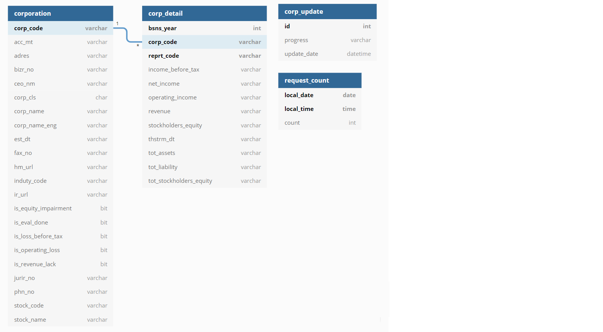

# Financial_Statement_Analyzer_BackEnd


## Goal

Open Dart API를 이용해 재무제표 데이터를 받아와서 데이터를 데이터베이스에 저장한 후, 요청이 있을 경우 데이터를 전송하는 프로젝트입니다.

[Financial Statement Analyzer FrontEnd](https://github.com/nicesick/Financial_Statement_Analyzer_FrontEnd) 에서 해당 데이터를 요청하여 시각화 할 수 있습니다.


## Environments

* [IntelliJ IDEA Community](https://www.jetbrains.com/ko-kr/idea/)
* [Spring-boot ](https://start.spring.io/) 2.4.2
* [MySql](https://dev.mysql.com/downloads/installer/) 8.0.23
* Spring-boot JPA
* JDOM
* [Open Dart API](https://opendart.fss.or.kr/)

```xml
<!-- pom.xml 에서 위의 라이브러리들을 다운받을 수 있습니다. -->

<dependencies>
    <dependency>
        <groupId>org.springframework.boot</groupId>
        <artifactId>spring-boot-starter-web</artifactId>
    </dependency>

    <dependency>
        <groupId>org.springframework.boot</groupId>
        <artifactId>spring-boot-starter-test</artifactId>
        <scope>test</scope>
    </dependency>

    <dependency>
        <groupId>org.springframework.boot</groupId>
        <artifactId>spring-boot-starter-data-jpa</artifactId>
    </dependency>

    <dependency>
        <groupId>org.springframework.boot</groupId>
        <artifactId>spring-boot-starter-jdbc</artifactId>
    </dependency>

    <dependency>
        <groupId>mysql</groupId>
        <artifactId>mysql-connector-java</artifactId>
        <scope>runtime</scope>
    </dependency>

    <!-- https://mvnrepository.com/artifact/org.jdom/jdom -->
    <dependency>
        <groupId>org.jdom</groupId>
        <artifactId>jdom</artifactId>
        <version>2.0.2</version>
    </dependency>
</dependencies>
```


## How to Execute

* 구동 전 application.properties 파일에 입력해야 할 사항들이 있습니다.
  * Open Dart API 를 이용하기 위한 API Key
    * [오픈다트 API](https://opendart.fss.or.kr/) 에서 발급받을 수 있습니다.
    * 2021.01.31 기준 - API Key 정보가 9개 이상 필요합니다.
    * **2021.02.04 기준 - API Key 정보 1개면 충분합니다.**
  * DB DataSource 생성을 위한 정보 (driver-class-name, url, username, password)

```properties
# resource/application.properties

# dart key 정보들은 ',' 을 기준으로 나눠집니다.
dart.key            = { Your Open Dart API Key }, { Your Open Dart API Key }

dart.corpCode.uri   = https://opendart.fss.or.kr/api/corpCode.xml
dart.corpInfo.uri   = https://opendart.fss.or.kr/api/company.json
dart.corpDetail.uri = https://opendart.fss.or.kr/api/fnlttMultiAcnt.json

# dart.document.uri   = https://opendart.fss.or.kr/api/document.xml
# dart.xbrl.uri       = https://opendart.fss.or.kr/api/fnlttXbrl.xml

spring.datasource.driver-class-name     = { Your driver class name for DB }
spring.datasource.jdbcUrl               = { Your jdbcUrl for DB }
# spring.datasource.url                   = jdbc:mysql://localhost:3306/annotationStudy?serverTimezone=UTC&characterEncoding=UTF-8
spring.datasource.username              = { Your username for DB }
spring.datasource.password              = { Your password for DB }

spring.jpa.hibernate.ddl-auto           = update
spring.jpa.show-sql                     = false

logging.level.com.jihun.study.openDartApi = INFO
```

* 해당 정보 입력 후에는 구동하시면 됩니다.

```powershell
> ./mvnw spring-boot:run
```


## File structure

* 기본적인 MVC 패턴에서 쓰였던 controller, service 로 나누고, JPA 를 이용해 데이터를 받아오는 repository, entity 로 구분하였습니다. 더 필요한 역할들로 config, dto, utils 로 추가적으로 구분하였습니다.

> config
>
> controller
>
> dto
>
> dtoImpl
>
> entity
>
> 	* count
> 	* stock
>
> repository
>
> service
>
> serviceImpl
>
> 	* api
> 	* keyCount
> 	* stock
>
> utils
>
> 	* evaluator
> 	* parser
> 	* stream


## ERD



* 테이블은 총 4개로 이루어져 있습니다.
  * corporation : 기업개황을 담당하고 있습니다.
  * corp_detail : 기업의 재무정보를 담당하고 있습니다.
  * corp_update : update 상태를 담당하고 있습니다.
  * request_count : 오픈다트 api 요청정보를 담당하고 있습니다.


## Issues

* Open Dart API 분당, 일당 사용횟수 제한

  * 오픈 다트 api 는 분당 1000회 api key 당 하루 10000회 라는 제한이 존재합니다.
  * <code>CountService</code> 를 생성하여, 오픈 다트 api 요청 마다 요청횟수를 저장하려고 시도하였으나, Thread 가 실행되는 환경에서는 제대로 된 연산이 불가능하였습니다. <code>synchronized</code> 키워드도 이용해 보았으나, 실패하였습니다.
  * 해결책으로는 Thread 환경에서 사용될 수 있는 <code>AtomicInteger</code> 클래스를 사용하였습니다.

  ```java
  /**
   * In serviceImpl/DartKeyCountService.java
   */
  	...DartKeyCountService Logics...
  
  	@Override
      public int addCount(LocalDate localDate, LocalTime localTime) throws InterruptedException {
          int output = 0;
          
          /**
           * 요청마다 incrementAndGet 으로 count 를 하고, 
           * 만약 분당 제한 수를 넘었을 경우에는 Thread.sleep 을 이용해 1분동안 기다립니다.
           */
          output = atomicInteger.incrementAndGet();
          if (output >= MAX_REQ_PER_MIN) {
              saveCount(output, localDate, localTime);
  
              Thread.sleep(60000);
              output = atomicInteger.getAndSet(0);
          }
  
          return output;
      }
  
  	...DartKeyCountService Logics...
  ```

* Open Dart API Zip Binary response 방식

  * 오픈 다트 api 에서 반환해주는 형식으로는 xml, json, 그리고 zip binary 파일이 있습니다.
  * zip binary 파일을 다운 받은 후, 압축해제된 xml 파일을 파싱해서 필요한 데이터를 얻어야합니다.
  * <code>ZipInputStream</code> 으로 zip을 해제한 inputstream을 xmlParser 에게 넘기려고 하였으나, 계속 오류가 발생하였습니다.
  * 결국, <code>ZipInputStream</code> 을 이용해 파일을 먼저 저장 한 후, xmlParser 에서는 저장된 파일을 불러들여 데이터를 얻었습니다.

  ```java
  /**
   * In utils/ZipStream.java
   */
  public static List<String> streamZip(final byte[] data, final String CHARSET) throws IOException {
      List<String>            output              = new ArrayList<>();
  
      ByteArrayInputStream    inputStream         = null;
      ZipInputStream          zipInputStream      = null;
      ZipEntry                zipEntry            = null;
  
      FileOutputStream        outputStream        = null;
      OutputStreamWriter      outputStreamWriter  = null;
      BufferedWriter          bufferedWriter      = null;
  
      InputStreamReader       inputStreamReader   = null;
      BufferedReader          bufferedReader      = null;
  
      inputStream         = new ByteArrayInputStream(data);
      zipInputStream      = new ZipInputStream(inputStream);
      inputStreamReader   = new InputStreamReader(zipInputStream, CHARSET);
      bufferedReader      = new BufferedReader(inputStreamReader);
  
      /**
       * zipInputStream 은 zipEntry 라는 것이 있어서 여러개의 파일을 구분할 수 있었습니다.
       */
      while((zipEntry = zipInputStream.getNextEntry()) != null) {
          outputStream        = new FileOutputStream(zipEntry.getName());
          outputStreamWriter  = new OutputStreamWriter(outputStream, CHARSET);
          bufferedWriter      = new BufferedWriter(outputStreamWriter);
  
          String line;
          while((line = bufferedReader.readLine()) != null) {
              /**
               * 우선 파일형태로 저장한 후, 나중에 xmlParser 에서 다시 파일을 불러오게 하였습니다.
               */
              bufferedWriter.write(line);
          }
  
          output.add(zipEntry.getName());
  
          zipInputStream.closeEntry();
          bufferedWriter.close();
      }
  
      return output;
  }
  ```

* 향상된 for 문안에서의 remove, insert 문제

  * 기업의 재무제표 데이터를 수신하고 기업에 대해 평가하는 부분에서 for 문을 사용하였습니다.
  * 기업정보는 존재하지만, 재무제표 정보는 없는 경우에는 기업정보 데이터를 제거하였는데, 해당 부분에서 <code>ConcurrentModificationException</code> 이 발생하였습니다.
  * <code>Collection</code> 클래스들은 iterator를 통해 검색범위를 넘어서는 것을 방지하기 위해 remove 혹은 insert 하면 오류를 발생시킨다고 합니다.
  * 따라서, remove, insert 가 for 문 도중에 가능한 <code>CopyOnWriteArrayList</code> 클래스를 사용하여 문제를 해결하였습니다.

  ```java
  /**
   * In serviceImpl/stock/DartStockService.java
   */
  private List<Corporation> evalCorporation(final List<Corporation> oldCorpInfos, final Map<String, List<CorpDetail>> corpDetails) {
      /**
    	 * CopyOnWriteArrayList 를 사용하기 위해 인자로 받은 리스트를 복사하였습니다.
    	 */
      List<Corporation> corpInfos = new CopyOnWriteArrayList<>(oldCorpInfos);
  
      for (Corporation corpInfo : corpInfos) {
          List<CorpDetail> targetCorpDetails = corpDetails.getOrDefault(corpInfo.getCorpCode(), null);
  
          if (targetCorpDetails == null) {
              corpInfos.remove(corpInfo);
              continue;
          } else {
              corpInfo.addCorpDetails(targetCorpDetails);
          }
  
          ... evalCorporation logics...
      }
  }
  ```

* JPA EmbeddedId 설정

  * EmbeddedId 는 테이블에서 pk 가 여러개일 경우 선언합니다.
  * EmbeddedId로 설정하였을 경우 respository를 생성할 때에도 아래를 지키며 생성합니다.

  ```java
  /**
   * In repository/CorpDetailRepository.java
   *
   * CrudRepository 혹은 JPARepository 를 extends 할 경우 <Entity, ID> 형식을 지켜주어야 합니다.
   */
  public interface CorpDetailRepository extends CrudRepository<CorpDetail, CorpDetailPK> {
  }
  ```

  ```java
  /**
   * In entity/stock/CorpDetailPK
   */
  @Embeddable
  public class CorpDetailPK implements Serializable, DartDto {
      private String  corpCode;
      private int     bsnsYear;
      private String  reprtCode;
  
      public CorpDetailPK() {
      }
  
      public CorpDetailPK(String corpCode, int bsnsYear, String reprtCode) {
          this.corpCode = corpCode;
          this.bsnsYear = bsnsYear;
          this.reprtCode = reprtCode;
      }
  
  	... Getter and Setter...
  }
  ```

* JPA OneToMany, ManyToOne 맵핑

  * 이제 해당 PK 를 이용해 테이블 간 OneToMany, ManyToOne를 매핑하려고 하였습니다.
  * JPA 에서는 OneToMany 와 ManyToOne 을 이용하여 테이블 간 양방향 연관관계를 맺을 수 있습니다.
  * <code>OneToMany</code> 에서는 **mappedBy 속성**을 통해, <code>ManyToOne</code> 에서는 **JoinColumns 속성**을 통해 두 테이블의 연관관계를 맺습니다.
  * 하지만 이 프로젝트에서는 corporation 에서 corp_detail 테이블을 조회할 수 있으면 되었기 때문에, OneToMany 단방향 연관관계로도 충분하였습니다.
  * 하지만 위에서 EmbbededId 를 생성하였기 때문에, mappedBy 속성에 값을 어떻게 넣어줘야 하는지 어려웠습니다.

  ```java
  /**
   * In entity/stock/Corporation.java
   */
  ...Corporation...
  
  /**
   * 다행히 <EmbbededID>.<PK> 형식으로 입력하니 정상적으로 연결되었습니다.
   */
  @OneToMany(
      fetch = FetchType.LAZY
      , cascade = CascadeType.ALL
      , mappedBy = "corpDetailPK.corpCode"
  )
  private List<CorpDetail> corpDetails = new ArrayList<>();
  
  ...Getter and Setter...
  ```

* update 시간 commit 시기문제

  * 사용자로부터 update 요청을 받게 되면, 서버는 open dart api를 통해 필요한 데이터를 수집합니다.
  * 다만 여러 사용자가 한번에 update 요청을 할 수 있으므로, 이미 update 가 시작되어 있으면 "updating" 상태를 return 할 수 있도록 만들고 싶었습니다.
  * JPA 에서의 commit 은 transaction 에 따르기 때문에, update 시간을 저장하는 부분과 open dart api 데이터를 모으는 부분의 transaction 을 다르게 해야 했습니다.
  * <code>Transaction</code> 의 propagation 속성을 추가하여 이 문제를 해결할 수 있었습니다.

  ```java
  /**
   * In serviceImpl/stock/DartStockService.java
   */
  ... DartStockService logics...
  
  /**
   * propagation 속성
   *
   * REQUIRED 	: 부모 트랜잭션 내에서 실행하며 부모 트랜잭션이 없을 경우 새로운 트랜잭션을 생성
   * REQUIRES_NEW : 부모 트랜잭션을 무시하고 무조건 새로운 트랜잭션이 생성
   * SUPPORT 		: 부모 트랜잭션 내에서 실행하며 부모 트랜잭션이 없을 경우 nontransactionally로 실행
   * MANDATORY 	: 부모 트랜잭션 내에서 실행되며 부모 트랜잭션이 없을 경우 예외가 발생
   * NOT_SUPPORT 	: nontransactionally로 실행하며 부모 트랜잭션 내에서 실행될 경우 일시 정지
   * NEVER 		: nontransactionally로 실행되며 부모 트랜잭션이 존재한다면 예외가 발생
   * NESTED 		: 해당 메서드가 부모 트랜잭션에서 진행될 경우 별개로 커밋되거나 롤백될 수 있음. 둘러싼 트랜잭션이 없을 경우 REQUIRED와 동일하게 작동
   */
  @Transactional(propagation = Propagation.REQUIRES_NEW)
  public void progressUpdating() throws LimitExceededException, InterruptedException, IOException, IllegalAccessException, InvocationTargetException, JDOMException, NoSuchMethodException {
      List<Map<String, String>>       corpKeys    = null;
      List<Corporation>               corpInfos   = null;
      Map<String, List<CorpDetail>>   corpDetails = null;
      
      ...progressUpdating logics...
  ```


## Todos

1. Update 환경 배치 방법으로 변경 필요
2. Spring-Security 추가 필요
3. 설계적 문제 : 평가방식을 주입할 수 있도록 evaluatorService로 새로 생성 필요
4. 평가방식 추가 : 영업이익 기울기 계산방식 + S-RIM 계산방식
5. ~~API 요청 수를 줄일 수 있는 방법 필요~~
   * 비즈니스 로직 순서를 변경하여 API 요청 수를 줄일 수 있었습니다.
   * 2021.02.04 기준 : 84000 호출 횟수 -> **3000 호출 횟수**


## References

* JPA
  * [Hibernate ORM 5.2.18.Final User Guide](https://docs.jboss.org/hibernate/orm/5.2/userguide/html_single/Hibernate_User_Guide.html) : Hibernate 에 대한 문서입니다. 저도 다 읽지는 못했지만 Hibernate 에 대해 정말 상세하게 알 수 있습니다.
  * [스프링 데이터 JPA 레퍼런스 번역](https://arahansa.github.io/docs_spring/jpa.html) : JPA  레퍼런스의 번역본입니다. 특히, 4.3. 쿼리 메소드들 부분에서 쿼리문법을 익히기 좋았습니다.
  * [JPA JoinColumns 사용시 주의 사항](https://medium.com/@SlackBeck/jpa-joincolumns-%EC%82%AC%EC%9A%A9%EC%8B%9C-%EC%A3%BC%EC%9D%98-%EC%82%AC%ED%95%AD-7bc22b98ed9b) : OneToMany, ManyToOne 연관관계를 작성 시 참조하면 좋은 문서입니다.
* Open Dart API
  * [IP 차단해제는 어떻게 하나요?](https://opendart.fss.or.kr/cop/bbs/selectArticleDetail.do) : 오픈다트 api 의 ip차단 정책에 대한 글입니다. 차단해제는 **02-3145-8620**으로 연락하면 해제할 수 있습니다.
  * [java 의 스트링 인코딩이해(자바 한글 깨짐해법을 위한연구)](https://gbox3d.tistory.com/entry/javaeuckr) : inputStream, outputStream 으로 데이터를 주고 받을 때, 인코딩 문제를 해결했던 문서입니다.
  * [자바 파일 압축과 압축 해제(ZipInputStream, ZipOutputStream)](https://madplay.github.io/post/java-file-zip) : zipInputStream 에 대해 이해할 때 보았던 문서입니다.
  * [Java Atomic Type 이해하기(AtomicBoolean, AtomicInteger)](https://readystory.tistory.com/53) : atomicInteger 를 처음 이해할 때 도움을 받았던 문서입니다.